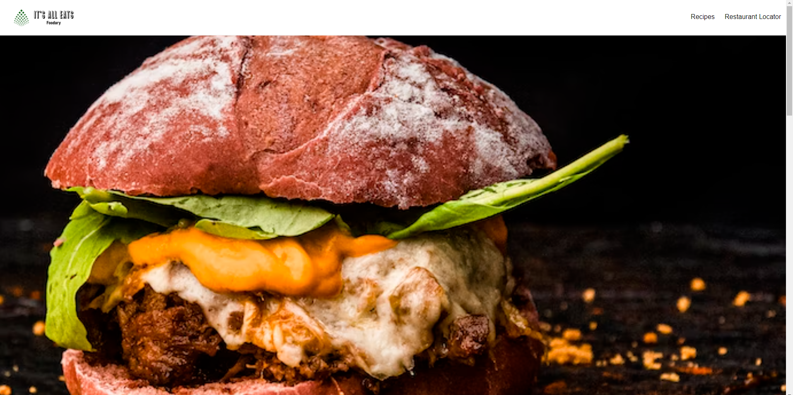

### It's All Eats

## Project Overview
With this assignment we used two real API's to create a functional website that allows users to:

* Search for restaurants in their area as well as around the world, the app will then respond by providing a list of restaurants native to that specific area with their adress.

* Generate random recipes from all around the world, while at the same time providing the user with a list of ingredients for that recipe. It also provide a detailed instructional video for the user to follow along with.

## list of APIs used

- https://www.themealdb.com/api/json/v1/1/random.php

- https://the-fork-the-spoon.p.rapidapi.com/sale-type-menu/list

## Name of developers and there role

- Andrew Evripidou (backend engineer)

- Corey Boughton (frontend engineer)

- Simone Monari (frontend engineer)

## Image of the application

# Link to the deployed website

[Link to the deployed website] https://aevripidou1996.github.io/Project-1/index.html

